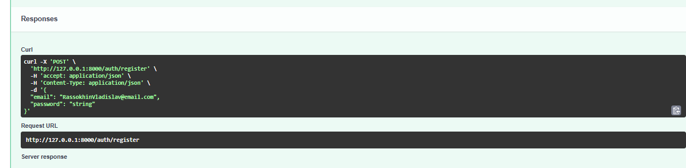
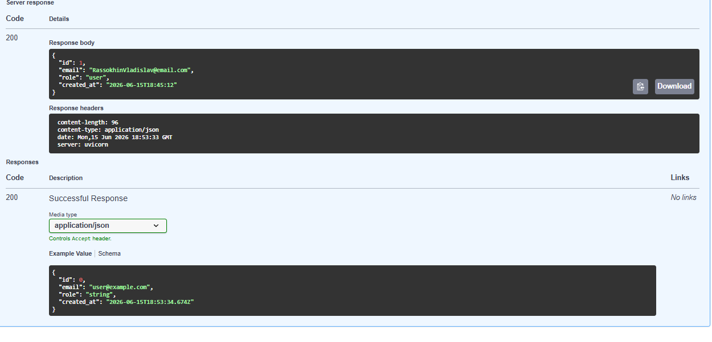
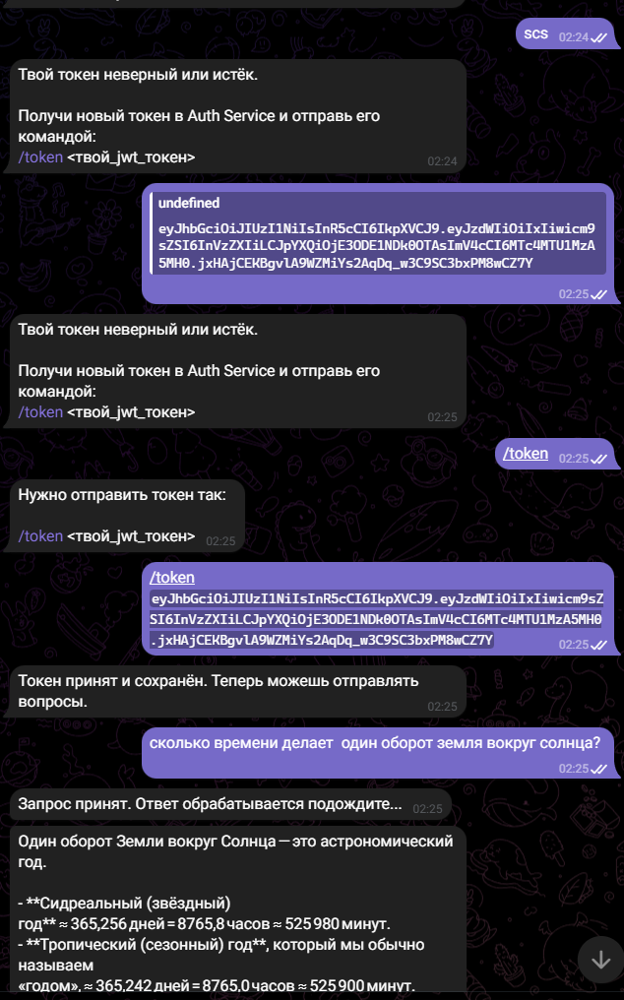
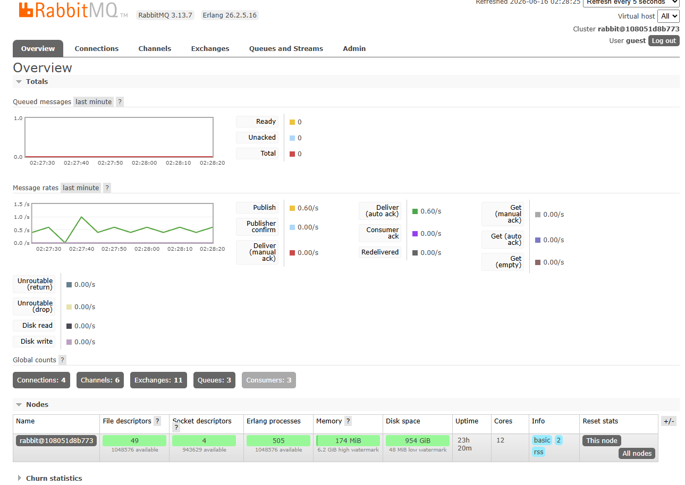
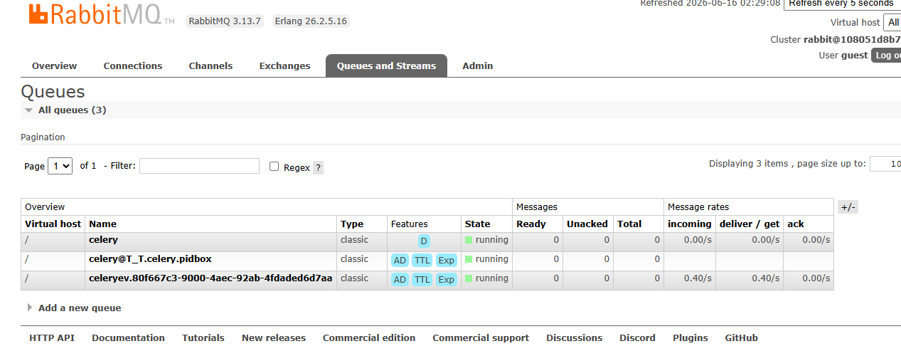

# LLM Telegram Platform

## Описание проекта

Проект представляет собой микросервисную систему для работы Telegram-бота с LLM-моделью через OpenRouter.

Система состоит из двух независимых сервисов:

- `auth_service` — отвечает за регистрацию, логин и выпуск JWT-токенов.
- `bot_service` — Telegram-бот на aiogram, принимающий JWT и выполняющий запросы к LLM через асинхронную очередь задач.


# Архитектура

```text
Telegram User
      ↓
Bot Service (aiogram)
      ↓
JWT validation
      ↓
RabbitMQ
      ↓
Celery Worker
      ↓
OpenRouter API
      ↓
Telegram response
````

Redis используется для хранения JWT, привязанных к Telegram user_id.

RabbitMQ используется как брокер задач Celery.

---

# Используемые технологии

* FastAPI
* aiogram
* SQLAlchemy
* SQLite
* JWT (`python-jose`)
* Redis
* RabbitMQ
* Celery
* Docker Compose
* httpx
* pytest
* fakeredis
* respx

---

# Структура проекта

```text
2_LLM/
│
├── auth_service/
│
├── bot_service/
│
└── docker-compose.yml
```

---

# Запуск инфраструктуры

Из корня проекта:

```bash
docker compose up -d
```

Будут запущены:

* Redis
* RabbitMQ

---

# RabbitMQ UI

```text
http://127.0.0.1:15672
```

Логин/пароль:

```text
guest / guest
```

---

# Запуск Auth Service

```bash
cd auth_service
uv run uvicorn app.main:app --reload --port 8000
```

Swagger:

```text
http://127.0.0.1:8000/docs
```

---

# Запуск Celery Worker

```bash
cd bot_service
uv run celery -A app.infra.celery_app:celery_app worker --loglevel=info --pool=solo
```

---

# Запуск Telegram Bot

```bash
cd bot_service
uv run python run_bot.py
```

---

# Пользовательский сценарий

1. Пользователь регистрируется через Auth Service.
2. Пользователь логинится и получает JWT.
3. Пользователь отправляет JWT Telegram-боту командой:

```text
/token <jwt>
```

4. Bot Service сохраняет JWT в Redis.
5. Пользователь отправляет сообщение боту.
6. Bot Service публикует задачу в RabbitMQ.
7. Celery worker вызывает OpenRouter.
8. Ответ LLM отправляется пользователю.

---

# Тесты

## Auth Service

```bash
cd auth_service
uv run pytest
```

## Bot Service

```bash
cd bot_service
uv run pytest tests
```

---

# Особенности реализации

* JWT создаётся только в Auth Service.
* Bot Service не обращается к БД Auth Service.
* Запросы к LLM выполняются асинхронно через Celery и RabbitMQ.
* Redis используется для хранения JWT, привязанных к Telegram user_id.
* Для локальной разработки на Windows Celery запускается с `--pool=solo`.

---

```
```

регистрация




 логин /auth/me



Скриншоты работы Telegram-бота



Overview




Queues and Streams




## Тестирование

Для проверки корректности работы сервисов используются автоматические тесты на `pytest`.

В `bot_service` реализованы тесты:

- `test_handlers.py` — проверяет обработчики Telegram-бота без реального обращения к Telegram API.
- `test_jwt.py` — проверяет создание и валидацию JWT-токенов.
- `test_openrouter_client.py` — проверяет клиент OpenRouter через мокирование HTTP-запросов.

Запуск тестов выполняется из директории `bot_service`:


uv run pytest -v


### Тестирование Auth Service

Проверяются:

- регистрация пользователя;
- авторизация пользователя;
- доступ к защищённым маршрутам;
- создание JWT-токенов;
- валидация JWT-токенов;
- обработка ошибочных сценариев авторизации.


